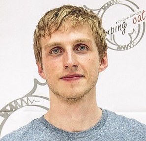
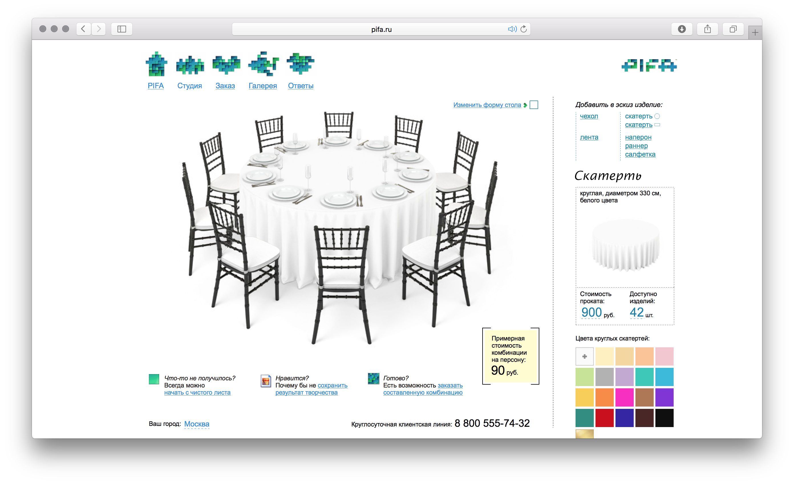
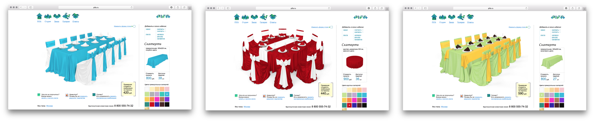
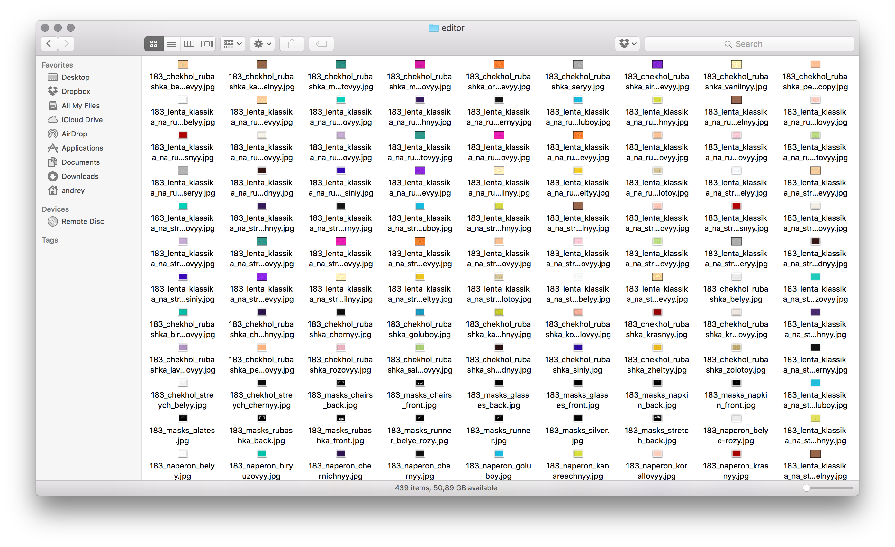
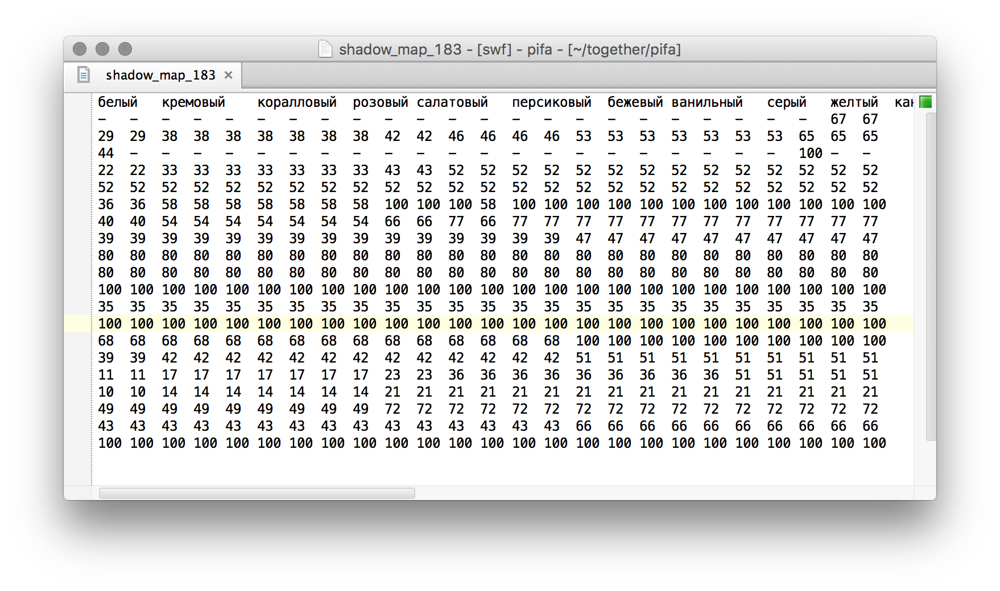
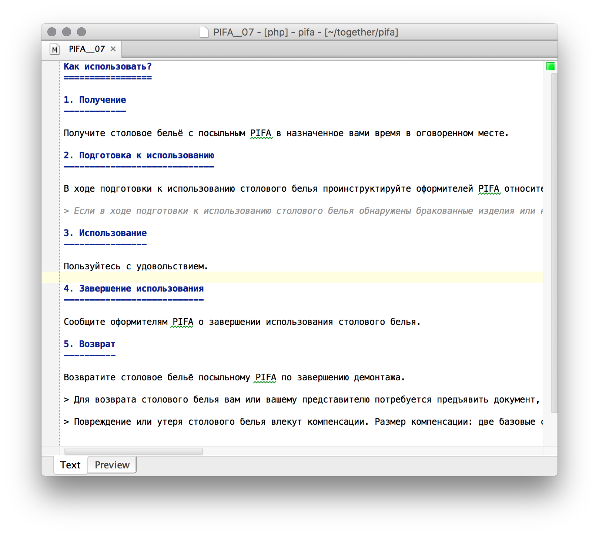
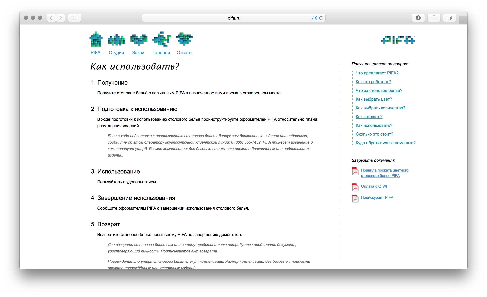
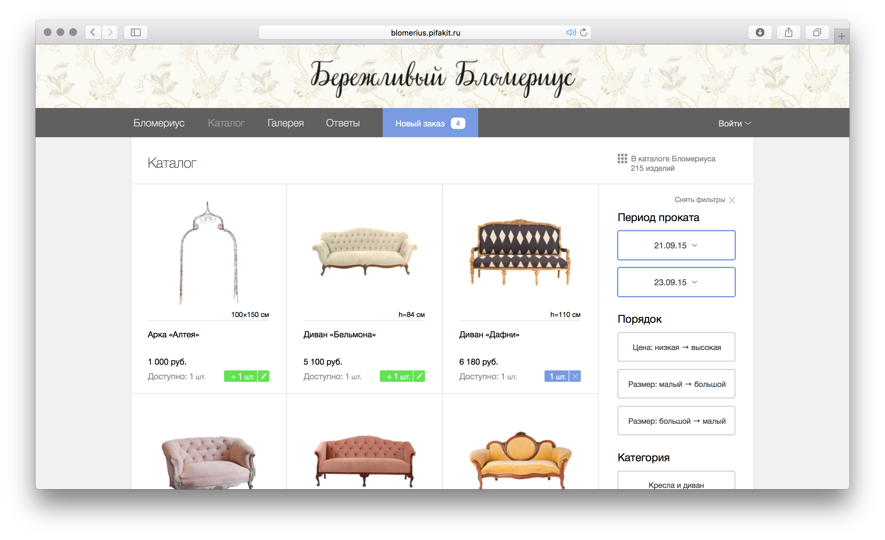

Hi, my name is Andy. 
On a personal level, I'm a lover of music, art and beautiful explanations.
On a professional level, I want to create something that brings people joy.

### Employment from 2008 to 2015

On the rise of Russian Facebook clone vk.com, I've single-handedly created a VK app that was installed by *500 000 users*, by virtue of having “viral” properties. I did the **Flash** programming and all the graphics myself.

The app was called “The fridge door”. Users could go to their friends’ fridges and leave post-it notes or magnets there. These magnets featured memes like the Rage Guy. Apparently, in 2008, I invented Facebook-like stickers.

Users could leave a note to a friend who was yet to install the app. This motivated people to install the app to see what was in the note. Probably because of this, my app went viral. ***I received up to 200 messages from users daily.*** Sadly, I was unable to monetize this thing, because at the time I didn't understand how social networks work in that respect.

--------------

Later I started working for a company that provided table linens for events. I fell in love with them because they were perfectionists and didn't allow the tiniest detail to go unnoticed, which is a rare occurence in my country. I've built an **Adobe Flash** app to showcase their products:

This “design view” consists of 27 layers. It even supports varying shadow intensity that depends on item color. In total, it requires *about 1000 image files, all of them generated from a 2GB PSB source*. I wrote a suite of **Photoshop scripts** that created images for the main view, the previews and the opacity masks.

That's when I experienced what it takes to build something beautiful. We painstakingly hunted for pixels that were slightly the wrong color, we fixed opacity masks until everything fit together nicely, and we repeated this process once more when the boss decided to hire another 3D-modeler and start from scratch.

-----------------------

That's when I should have stopped, but we decided to make a shopping cart for my client's business in **Flash**. They wanted the user to be able to order products right from the “design view” I showed you above, and also create all sorts of other synergies between the site's sections. Doing only the design view in Flash and the other sections in HTML+JS was not an option for them.

So we decided to create *a whole ecommerce solution in Flash*. Now, of course Adobe has created a UI components and layout system specifically for this purpose, called **Flex**, but it was too clumsy and unresponsive for our purposes, so we decided to program everything from scratch.

I implemented, among other things

* a SELECT element;
* an IMG element with preloader;
* a scrolling mechanism;
* content management tools; and
* *an async command queue system.*

Basically, for some tasks I needed to recreate parts of HTML, because Flash's HTML and CSS support is really rudimentary. I wrote a whole page of hacks to process **Markdown** into something that looks like **HTML**+**CSS**. It's really absurd what I had to do to make this:

look like this:

***As a result of this unreasonable perfectionism we had pixel-perfect cross-platform UI, every font we needed, smooth transitions and basically a single-page async app, in 2011.***

On the server side we implemented a custom booking system in **PHP**, because the usual ecommerce solutions don't work for rentals. Most of the backend was done by another developer, but I inherited all of his code later.

***This system allowed my client to process orders in 15 seconds, instead of the industry standard of 1 day.***

<video src="order.mp4" controls></video>

This feature is used by approximately 1000 returning customers. I imagine they are very happy.

-----------------------

Business was growing rapidly, achieving tens of orders on the same day in summer. All these orders required setup and teardown, so we needed systems for managing workers.

Using **Ruby on Rails** and **Angular**, I created a highly responsive worker management solution. This allows the manager to assign orders to setup and teardown workers, record and view their performance metrics.

Because it’s an internal tool, I can’t show it here, but it allows a single manager to manage about fifty simultaneous events, which means:

* receiving customers’ orders;
* making sure the payment is made in time;
* managing shipping;
* assigning orders to workers;
* making sure they arrive on time;
* recording customer feedback and relaying it to workers;
* answering any customer question regarding their order in less than 15 seconds.

I can't take credit for all of the above, because the interaction design was mostly done by my boss. I just made sure that every feature was implemented as well as physically possible.

We wanted to eventually allow the worker-order assignment not demand our manager’s attention. In order to achieve this, I created an interactive system for workers, where they could pick the most convenient orders for themselves. Of course, there was often a fight over the most convenient and profitable orders. As a solution, I created a real-time queueing system that did not allow workers to step on each other’s toes. Everyone in the queue knew when it was their turn and who was selecting orders. I tried to create this system using **React**/**Clojurescript**, just for fun, but it turned out to be difficult to debug, so I started from scratch in **Angular**.

-----------------------

The table linen rental business was doing fine, but we had all these technologies and a vast amount of know-how in the industry, which we didn't feel we were using to the fullest.

So we decided to sell our byproducts by creating our own SaaS solution for event rental companies.

*For the first five months we didn't write any code at all, only creating specs and dreaming up database structure.* My boss was not a developer, but he wanted to know all the details of the system, so we created a spec format that could be reasonably easily understood by a non-programmer, yet was highly specific. Our specs were written in Russian, basically one test per **Ruby** code line. This way, the boss could understand most details of the system without being a programmer.

In total, our SaaS system had about 1000 tests.

We designed this system completely from scratch. I remember having long discussions about the order of menu items, about names of different things, about all kinds of little fiddly things you really don't think about when you are using the app.

We used Ruby on Rails for backend and **Angular** + **Coffeescript** + **SASS** for frontend. For storage we used **Postgres**, because Postgres schemas allow to create multitenant applications.

It was quite a challenge to make the UI elements we designed work everywhere consistently. Every day I felt miserable and stupid, banging my head against some issue with **Angular**-**jQuery** integration or strange JS execution bugs. I felt the need to be a part of a larger team where I could at least hope for some inspiration or advice.

This is the work I did:

* created a database structure;
* programmed controllers and models in **Ruby on Rails**;
* set up a web server (**nginx** + **Phusion Passenger**);
* implemented delayed processing of uploaded photos with **delayed_job**;
* interfaced our system with third-party APIs for payments, geolocation and Russian morphology;
* set up AWS backups;
* implemented internationalization;
* programmed the UI in **Angular** + **jQuery**;
* managed a remote team of CSS wizards; and
* programmed export of user data to beautiful Excel documents with **AXLSX**.

What my boss did:

* graphic design in **Sketch** and interaction design;
* functional specifications; and
* quality assurance.

We scored 11 out of 12 on the Joel Test (no schedule 😀). We used **Trello** as a planning tool and a bug database (around 2500 cards in total).

In the end we achieved everything we planned regarding this project, albeit at the cost of health and personal relationships. I feel that maybe I can overcome this tendency if I know the best industry practices, which is why I’m seeking a team where programmers are a bit more specialized. I still believe that developers should understand the whole stack.

<video src="article.mp4" controls></video>

I am proud of the work I've done for PIFA, as it's the most beautiful thing I've ever produced. We received some very kind words such as “this feels like iOS”. I'd say iOS beta.
This system is only three months old and it's already used by about fifty companies. You can browse them here: [pifakit.ru](http://pifakit.ru). 

A good example of the site made with PIFA's system is [blomerius.pifakit.ru](http://blomerius.pifakit.ru).

-------------
Other work I did in the meantime (without links):

* I made a map of tram stops for my city using **D3**. It was supposed to allow the authorities to efficiently spend the tram stop renovation budget.
* I created software for the classification of geophysical signals with **Hierarchical Temporal Memory (NuPIC)**

-------------
Stuff I'm interested in personally:

* rational decision-making;
* generative art (especially recent developments using deep learning, such as StyleNet);
* swing dancing; and
* optimizing all areas of life.

------------
At the moment I'm seeking the next company to fall in love with. It's important for me to feel that my work is helping people.

If you like my style, please contact me via email: [andreyshestakov@icloud.com](mailto:andreyshestakov@icloud.com)